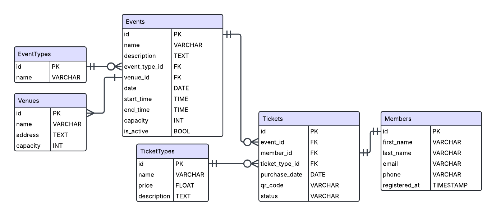

# 🎟️ Event Ticketing System (PostgreSQL)

This is a freelance-style database project designed to manage events, attendees, ticket types, and revenue analytics. Modeled after real-world use cases for small event-based businesses.

## 📁 Features

-   Normalized relational schema (6+ tables)
-   Support for multiple event types and venues
-   Tickets with customizable types (VIP, General, etc.)
-   Query suite for attendance, sales, and revenue

## 🛠 Tech Stack

-   PostgreSQL
-   ERD via dbdiagram.io
-   SQL (DDL + analytical queries)

## 🧠 What I Practiced

-   Schema design with lookup tables and FKs
-   Revenue calculation with `JOIN` + `GROUP BY`
-   Filtering by ticket types, dates, and attendance
-   Indexing and normalization

## 📊 Analytics Included

-   Tickets sold per event
-   Revenue per event
-   Top attendees (returning guests)
-   Monthly performance reports

## 📸 ERD Preview

## 📂 Files

-   `schema.sql` – DDL setup
-   `analytics.sql` – Revenue & reporting queries
-   `/assets/` – ERD diagrams
